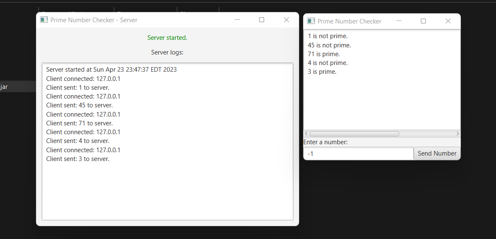
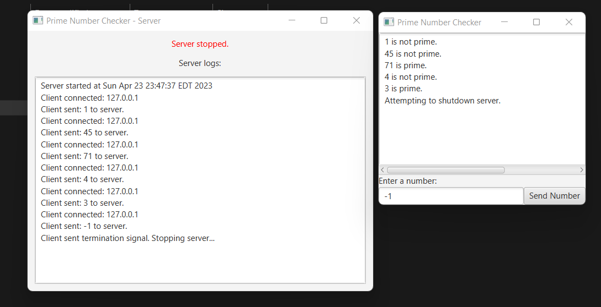

# Prime Number Checker

Uses a server and client application to check if a number is a Prime.

## Requirements
Java 18+

## Installation
Install my-project with npm

```bash
  git clone https://github.com/manuelosorio/prime-number-checker.git
  cd prime-number-checker
```


windows:
```bash
mvnw clean package
```

linux:
```sh
./mvnw clean package
```

jar files are located in:
- /client/target
- /server/target

## Screenshots

